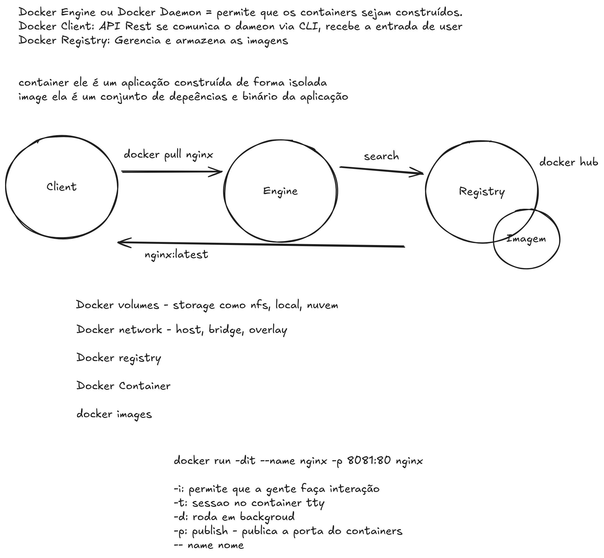

# Docker - Primeiros Passos

[https://emerson-silva.blog.br/posts/docker-primeiros-passos/]




## Docker Commit

Cria uma imagem a partir de um container em execução, capturando seu estado atual (como se fosse um snapshot).

```bash

docker run -dit ubuntu bash

docker exec -it ubuntu apt update && apt install nginx -y

docker commit ubuntu ubuntu-imagem:1.0


```

## Dockerfile


Um arquivo de texto com instruções declarativas para construir uma imagem Docker de forma automatizada e reproduzível.

### Principais Instruções do Dockerfile

#### 1. `FROM`
Define a **imagem base** para construir a imagem Docker.

```Dockerfile
FROM ubuntu:22.04
```
Todo Dockerfile deve começar com FROM.

Pode usar imagens oficiais ou personalizadas.

#### 2. `RUN`
Executa comandos durante a construção da imagem.

```RUN apt-get update && apt-get install -y nginx```

Cada RUN cria uma nova camada na imagem.

#### 3. `COPY e ADD`

Copia arquivos para dentro da imagem.

`COPY index.html /usr/share/nginx/html/`

- COPY: simples e direto.

- ADD: também aceita arquivos .tar e URLs (use com cuidado).

#### 4. CMD

Define o comando padrão a ser executado ao rodar o container.

```CMD ["nginx", "-g", "daemon off;"]```

#### ENTRYPOINT

Define o comando principal fixo do container.

```ENTRYPOINT ["python3", "app.py"]```


- Diferente de CMD, é mais difícil sobrescrever.

- Pode combinar ENTRYPOINT com CMD para passar argumentos.

#### ENV NODE_ENV=production


```ENV NODE_ENV=production```

Útil para configuração de aplicativos.


#### EXPOSE

Documenta a porta que o container usará.

```EXPOSE 80```

- Não publica a porta automaticamente.


#### VOLUME

Cria um ponto de montagem para persistência de dados.

```VOLUME /var/lib/mysql```

- Dados no volume não são perdidos após parar o container.


#### LABEL

```LABEL maintainer="emerson@example.com"```


### Exemplo completo

```
FROM node:18
WORKDIR /app
COPY package*.json ./
RUN npm install
COPY . .
EXPOSE 3000
CMD ["npm", "start"]
```

